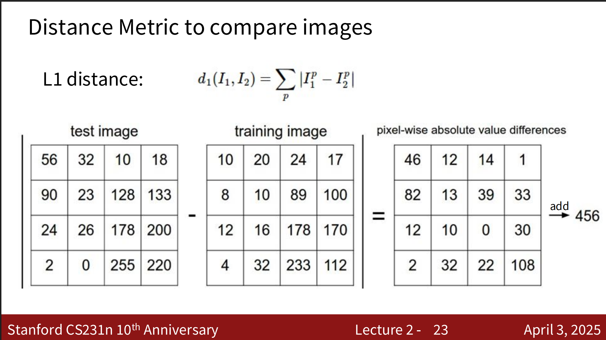
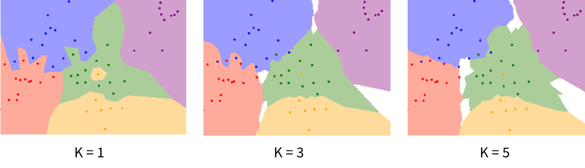
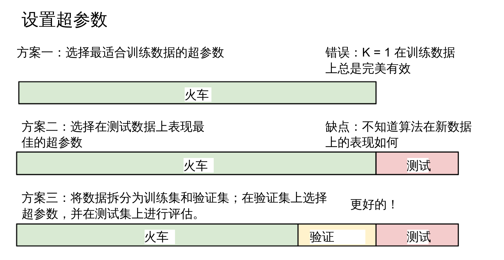
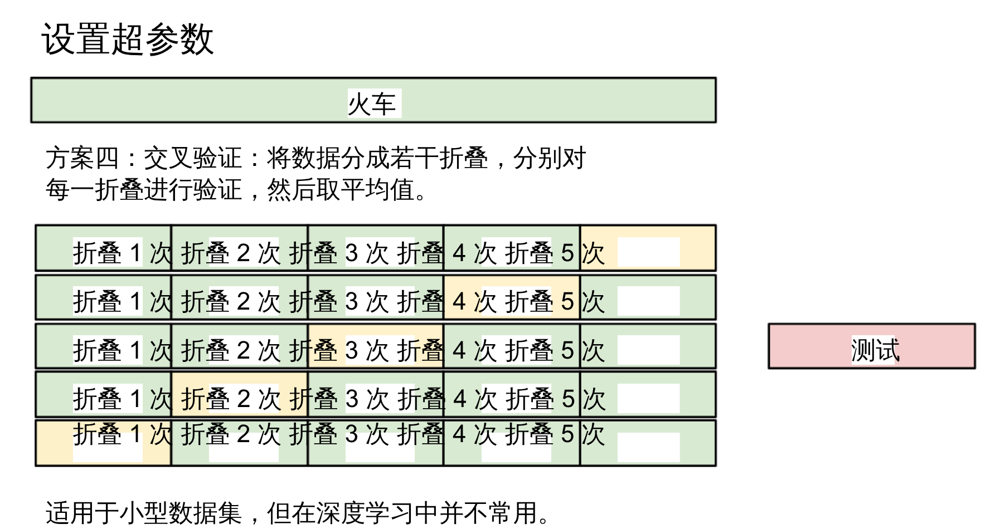

## 图像的定义
我们一般将图像定义为数据矩阵或者更一般的数据张量，一张图像的每个像素值介于0-255之间。


## 计算机视觉面临的挑战
一张图像上有照明，会改变我们观测这个图像部分的像素值；另外一个例子就是移动，最明显的例子就是动图，当图像上的物体移动，此时这个物体并没有改变，但是我们观测部分的像素值却发生变化了。所以计算机视觉面临的挑战有
- 照明
- 背景杂乱
- 比例问题
- 变形（例如动物，有很多状态）
  

## 识别图像的方法
- 边缘识别 edge detectors（基于创建逻辑和程序，很难扩展）
- 机器学习 machine learning （基于数据驱动） 

### 机器学习识别图像步骤
- 收集图像及其标签的数据集
- 使用机器学习算法来训练数据中的图像和相关标签（分类器）
```py
def train(images, labels):
    # Machine learning!
    return model
```
- 在新图像上评估分类器
```py
def predict(model, test_images):
    # use model to predict labels
    return test_labels 
```

### 机器学习识别图像算法
- 最邻近分类



其中，该算法在train的时间复杂度是O(1),但是在预测的时间复杂度是O(n),这是不被接受的。通常，一个好的算法我们希望他预测是快速的，就像gpt给我们返回答案一样；训练慢一点是可以被接受的，因为他可以离线完成。

这个算法会不会有什么缺点呢？

答案是显然的，我们总是从最邻近复制标签，但是很有可能最邻近是一个噪点，会导致我们的预测出现幻觉。针对这个问题，这个算法有一个改善，不再从最邻近复制标签，而是从K个最近点中取多数票。就像下面这样


### K和距离的选择
这涉及到超参数选择的问题，目前有四种方案

